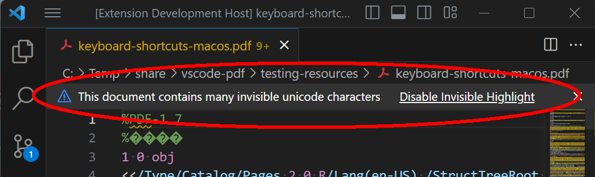

# LSP Example

Heavily documented sample code for https://code.visualstudio.com/api/language-extensions/language-server-extension-guide

## Functionality

This Language Server works for plain text file. It has the following language features:
- Completions
- Diagnostics regenerated on each file change or configuration change

It also includes an End-to-End test.

## Structure

```
.
├── client // Language Client
│   ├── src
│   │   ├── test // End to End tests for Language Client / Server
│   │   └── extension.ts // Language Client entry point
├── package.json // The extension manifest.
└── server // Language Server
    └── src
        └── server.ts // Language Server entry point
```

## Running the Sample

- Run `npm install` in this folder. This installs all necessary npm modules in both the client and server folder
- Open VS Code on this folder.
- Press Ctrl+Shift+B to start compiling the client and server in [watch mode](https://code.visualstudio.com/docs/editor/tasks#:~:text=The%20first%20entry%20executes,the%20HelloWorld.js%20file.).
- Switch to the Run and Debug View in the Sidebar (Ctrl+Shift+D).
- Select `Launch Client` from the drop down (if it is not already).
- Press ▷ to run the launch config (F5).
- In the [Extension Development Host](https://code.visualstudio.com/api/get-started/your-first-extension#:~:text=Then%2C%20inside%20the%20editor%2C%20press%20F5.%20This%20will%20compile%20and%20run%20the%20extension%20in%20a%20new%20Extension%20Development%20Host%20window.) instance of VSCode, open a PDF document in 'plain text' language mode.

# VSCode PDF extension

PDF (**Portable Document Format**) is an open page description language standard for electronic documents defined by ISO 32000-2:2020 ([available at no cost](https://www.pdfa-inc.org/product/iso-32000-2-pdf-2-0-bundle-sponsored-access/)).

## PDF files are BINARY!

Technically all PDF files are **binary files** and should **never** be arbitrarily edited in text-based editors such as VSCode - as this can break them! However, for the purposes of learning PDF or manually writing targeted PDF test files, it is possible to use a text editor if sufficient care is taken. The functionality provided by this extension is **NOT** intended for debugging or analysis of real-world PDF files as such files are "too binary" for text editors such as VSCode. Use a proper PDF forensic inspection utility or a dedicated hex editor. 

If you see any of these messages in VSCode then your PDF file is unsuitable/incompatible with this extension and _**will get corrupted if saved!**_:




If you see this VSCode error message then you **must** choose "Ignore":


## Learning PDF

Although PDF files are technically binary, when first learning PDF or when manually creating targeted test files it is convenient to use  "pure text" PDF files. As a result it is more productive to have a modern development/IDE environment with features such as syntax highlighting, folding, Intellisense, go to definition, etc.

A minimal PDF only requires binary bytes (>127) for the 4-bytes of the binary marker comment in the 2nd line of the file. All other binary data, such as images or Unicode sequences, can be encoded using `ASCIIHexDecode` or `ASCII85Decode` filters, hex strings, literal string escape sequences, name object hex codes, etc.

# Features

The following functionality is enabled for files with extensions `.pdf` and `.fdf` (Forms Data Field) as both file formats use the same PDF COS ("_Carousel Object System_") syntax and file structure.

## Syntax Highlighting
Syntax highlighting of PDF COS syntax and PDF content streams including special handling of _most_ PDF rules for delimiters and whitespace:
- PDF dictionary objects (start `<<` and end `>>`)
- PDF array objects (start `[` and end `]`)
- PDF literal string objects (start `(` and end `)` with `\` escape sequences) 
- PDF hex string objects (start `<` and end `>`)
- PDF name objects (start `/` with `#` hex pairs)
- PDF integer and real number objects (including with leading `+`, `-`, `.` or multiple `0`s)
- PDF comments (start with `%` to end-of-line)
- all case-sensitive PDF keywords (`endobj`, `endstream`, `false`, `null`, `obj` including associated object identifier, `R` including associated object identifier, `startxref`, `stream`,  `trailer`, `true`, `xref`)
- PDF content stream operators when occuring between `stream` and `endstream` keywords

To inspect the tokens that the TextMate syntax highlighter has recognized, select "Developer: Inspect Editor Tokens and Scopes" from the VSCode command pallette via the View menu. For convenience, assign the command a new shortcut such as `CTRL` + `SHIFT` + `ALT` + `I` or &#8984; &#8679; `I`. 

| PDF construct | [TextMate token name](https://macromates.com/manual/en/language_grammars#naming_conventions) |
| --- | --- |
| Array `[` `]` | `punctuation.definition.array.pdf` |
| Content stream operators (_only between `stream` and `endstream` keywords_) | `keyword.section.content-stream.pdf`</br> `keyword.operator.content-stream.pdf` |
| Comment | `comment.line.percent.pdf` |
| Dictionary `<<` `>>` | `punctuation.definition.dictionary.pdf` |
| Hex string `<` `>`| `string.quoted.hex.pdf` |
| Indirect reference `X Y R` (_not inside content streams_) | `keyword.control.reference.pdf` |
| Inline image data (_only between `ID` and `EI` operators_) | `binary.data.inlineimage.pdf` |
| Integer | `"constant.numeric.integer.pdf` |
| Keywords `endobj`, `false`, `null`, `X Y obj`, `startxref`, `true` | `keyword.control.pdf` | 
| Literal string `(` `)` | `string.quoted.literal.pdf` |
| Literal string escape sequences |  `constant.character.escape.backslash.pdf`</br> `constant.character.escape.backspace.pdf`</br> `constant.character.escape.eol.pdf`</br> `constant.character.escape.formfeed.pdf`</br> `constant.character.escape.linefeed.pdf`</br> `constant.character.escape.octal.pdf`</br> `constant.character.escape.return.pdf`</br> `constant.character.escape.tab.pdf`|
| Name (_starts with `/`_) | `variable.other.name.pdf` |
| Real number | `constant.numeric.real.pdf` |
| Conventional cross-reference table (_between `xref` and `trailer` keywords_) | `keyword.section.xref-trailer.pdf`</br> `keyword.control.xref-subsection.pdf`</br> `keyword.control.free-object.pdf`</br> `keyword.control.inuse-object.pdf` |
| | |

### Known issues with TextMate grammar (pdf.tmLanguage.json)
- PDF literal string `\)` and `\(` escape sequences are not explicitly identified (all other literal string escape sequences from Table 3 in ISO 32000-2:2020 are supported)
- the PDF content stream text operator `"` is not explicitly supported in `keyword.operator.content-stream.pdf`

## Folding
Folding is enabled for PDF objects (`X Y obj` and `endobj`) and multi-line PDF dictionary objects (`<<` and `>>`). The dictionary start `<<` needs to be on a line by itself or preceded by a PDF name (e.g. the key name in a containing dictionary for an inline dictionary).

### Windows folding shortcuts:
- `CTRL` + `SHIFT` + `[` = fold region
- `CTRL` + `SHIFT` + `]` = unfold region
- `CTRL` + `K`, `CTRL` + `[` = fold all subregions
- `CTRL` + `K`, `CTRL` + `]` = unfold all subregions
- `CTRL` + `K`, `CTRL` + `0` = fold all regions
- `CTRL` + `K`, `CTRL` + `J` = unfold all regions
### Mac folding shortcuts:
- &#8984; `[` = fold region
- &#8984; `]` = unfold region
- &#8984; `K`, &#8984; `[` = fold all subregions
- &#8984; `K`, &#8984; `]` = unfold all subregions
- &#8984; `K`, &#8984; `0` = fold all regions
- &#8984; `K`, &#8984; `J` = unfold all regions

## Go To Functionality
VSCode allows easy navigation and examination of definitions, declarations and references. For PDF the following programming language equivalences are used:
- **definition**: a PDF object (`X Y obj`)
- **declaration**: the in-use cross-reference table entry of a PDF object (e.g., `0000003342 00000 n`)
- **reference**: an indirect references (`X Y R`) to a PDF object

Placing the cursor anywhere in a conventional cross-reference table entry for an in-use object (e.g., `0000003342 00000 n`), and then selecting "Go to definition" will jump the cursor to the associated object (`X Y obj`). Note that the very first entry in the cross-reference table of an original PDF (i.e. one without any incremental updates) should always be `0000000000 65535 f` and represents the start of the free list and thus there is no associated object 0. 

Placing the cursor anywhere on an indirect reference (`X Y R`), and then selecting "Go to definition" will jump the cursor to the associated object (`X Y obj`), using the cross reference table information.

Placing the cursor anywhere on an object definition (`X Y obj`), and then selecting "Show references" will find all indirect references (`X Y R`) to that object.


### Windows Go To shortcuts
- `F12` = goto definition
- `ALT` + `F12` = peek definition
- `CTRL` + `K`, `F12` = open definition to the side
- `SHIFT` + `F12` = show references
### Mac Go To shortcuts
- `F12` = goto definition
- &#8997; `F12` = peek definition
- &#8984; `K`, `F12` = open definition to the side
- &#8679;  `F12` = show references


# Creation of largely text-based PDFs

Using [QPDF](https://github.com/qpdf/qpdf):
```bash
qpdf -qdf file.pdf file-as-qdf.pdf
```

Using Adobe Acrobat (_commercial tool_):
- open a PDF
- menu: File | Save as Other... | Optimized PDF...
- create a new PDF Optimizer profile and save as "Human readable"
    - "Make compatible with" = retain existing
    - ensure all Image settings have "Downsample" = "Off" and "Compression" = "retain existing"
    - Fonts - ensure "Do not unembed any font" is checked
    - disable Transparency, Discard Objects and Discard User Data tabs
    - Clean Up: make sure "Object compression options" = "Remove compression"

Note that this Adobe Acrobat method will not be as "pure text" as the QPDF method as content streams, etc. have their compression filters retained whereas QPDF will convert all streams to uncompressed raw data.

## Locating PDFs with specific features

Avoid using `^` start-of-line due to PDFs specific end-of-line rules which can vary and not match the current platform.

* Number of incremental updates = approximated by number of `%%EOF` or `startxref` lines

```bash
grep --text --count -Po "%%EOF" *.pdf | sed -e "s/\(.*\):\(.*\)/\2\t\1/g" | sort -nr
grep --text --byte-offset -Po "%%EOF" *.pdf
```

* Find the number of objects in each PDF (trailer /Size entry)

```bash
grep --text -Po "/Size [0-9]+" *.pdf
```

* Find all conventional cross-reference table entries (in use = `n`', free = `f`)

```bash
grep --text -Po "[0-9]{10} [0-9]{5} [fn]" *.pdf
grep --text -Po --count "[0-9]{10} [0-9]{5} f" *.pdf | sed -e "s/\(.*\):\(.*\)/\2\t\1/g" | sort -nr
``` 

* Find the xref sub-section marker lines for conventional cross-reference table PDFs. Can then find sparse cross-reference tables in incremental updates. Multi-line so must use `pcregrep -M`. 

```bash
pcregrep -Mo --color=auto --buffer-size=999999 --text "[^t]xref[\r\n][0-9]+ *[0-9]+" *.pdf
```
